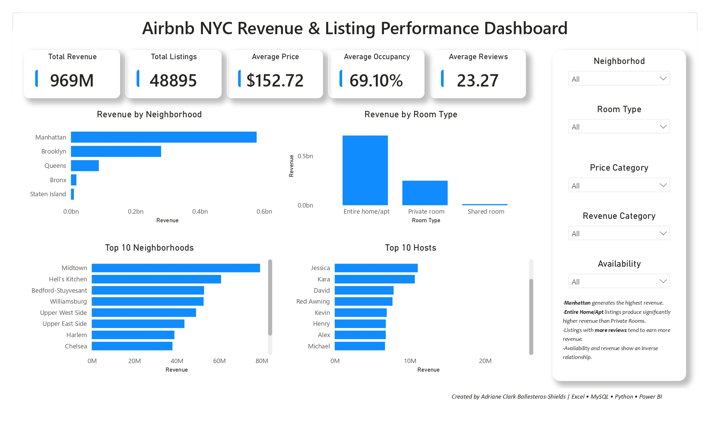

# Airbnb NYC Revenue & Listing Performance Analysis

## Project Overview

This project analyzes Airbnb listings in New York City to uncover revenue drivers, pricing patterns, host performance, and neighborhood profitability. The goal is to transform raw Airbnb data into actionable business insights through Excel, MySQL, Python, and Power BI.

The project follows a complete end-to-end data analytics workflow, including data cleaning, exploratory analysis, SQL querying, business intelligence reporting, and dashboard development.

---

## Business Problem

Airbnb operates across thousands of listings with varying prices, occupancy rates, room types, and host performance. Understanding which factors contribute to higher revenue and stronger listing performance is essential for both Airbnb and property hosts.

This project aims to answer the following business questions:

* Which borough generates the highest revenue?
* Which room type contributes the most to revenue?
* Which neighborhoods are the most profitable?
* Who are the highest-performing hosts?
* How do pricing and availability impact listing performance?
* What opportunities exist to maximize revenue and occupancy?

---

## Dataset

**Source:** Airbnb NYC Listings Dataset

**Records:** 48,895 Listings

**Features:**

* Listing Information

  * ID
  * Listing Name
  * Room Type

* Host Information

  * Host ID
  * Host Name
  * Number of Listings

* Location Information

  * Neighbourhood
  * Neighbourhood Group (Borough)
  * Latitude
  * Longitude

* Performance Metrics

  * Price
  * Minimum Nights
  * Number of Reviews
  * Reviews Per Month
  * Availability (365 Days)
  * Estimated Revenue

---

## Project Workflow

### 1. Data Cleaning (Excel)

* Converted raw dataset into structured tables
* Handled missing values
* Created calculated fields:

  * Revenue Category
  * Price Category
  * Availability Category
  * Occupancy Rate
* Validated data types and formatting

### 2. Database Analysis (MySQL)

* Imported cleaned dataset into MySQL
* Performed exploratory SQL analysis
* Used aggregations, filtering, ranking, and window functions
* Analyzed revenue, occupancy, pricing, and host performance

### 3. Exploratory Data Analysis (Python)

* Data profiling and validation
* Revenue analysis
* Occupancy analysis
* Correlation analysis
* Host and neighborhood performance evaluation

Libraries Used:

* Pandas
* NumPy
* Matplotlib

### 4. Business Intelligence Dashboard (Power BI)

Developed an executive dashboard featuring:

* Revenue KPIs
* Listing KPIs
* Occupancy KPIs
* Revenue by Borough
* Revenue by Room Type
* Top Revenue Neighborhoods
* Top Revenue Hosts
* Interactive Slicers

---

## Key Business Insights

### 1. Manhattan Dominates Revenue Generation

Manhattan contributes the largest share of Airbnb revenue despite having fewer listings than some competing boroughs.

### 2. Entire Homes Generate the Highest Revenue

Entire Home/Apt listings significantly outperform private and shared rooms in revenue generation.

### 3. Revenue is Concentrated in Specific Neighborhoods

A small number of neighborhoods account for a substantial portion of total Airbnb revenue.

### 4. Top Hosts Control a Large Revenue Share

The top-performing hosts generate significantly more revenue than average hosts, indicating market concentration.

### 5. Higher Occupancy Drives Stronger Revenue

Listings with lower availability generally indicate stronger booking demand and higher revenue generation.

### 6. Premium Pricing Can Still Maintain Demand

Higher-priced listings in prime locations continue to attract bookings and generate substantial revenue.

---

## Business Recommendations

### Optimize High-Revenue Boroughs

Increase marketing and host acquisition efforts in top-performing boroughs such as Manhattan and Brooklyn.

### Encourage Entire Home Listings

Promote high-performing room types through incentives and improved visibility.

### Focus on High-Potential Neighborhoods

Prioritize neighborhood-specific campaigns in areas generating the highest revenue.

### Support Emerging Hosts

Provide educational resources and promotional opportunities for smaller hosts to improve market competitiveness.

### Improve Occupancy Management

Encourage hosts with excessive availability to adopt dynamic pricing strategies and promotional discounts.

### Expand Revenue Forecasting

Develop predictive models to forecast occupancy and revenue trends for future decision-making.

---

## Tools

| Tool     | Purpose                           |
| -------- | --------------------------------- |
| Excel    | Data Cleaning & Transformation    |
| MySQL    | Data Querying & Analysis          |
| Python   | Exploratory Data Analysis         |
| Power BI | Dashboard Development             |
| GitHub   | Project Documentation & Portfolio |

---

## Project Structure

```text
Airbnb-NYC-Analysis/
│
├── data/
│   └── airbnb_datasheet_raw.csv
│   └── airbnb_cleaned_final.csv
│
├── excel/
│   └── airbnb_datasheet.xlsx
│
├── powerbi/
│   ├── dash.pbix
│   └── dash.jpg
│
├── python/
│   └── airbnb_analysis.ipynb
│
├── sql/
│   └── queries.sql
│
├── README.md

```

---

## Dashboard Preview




---

## 👤 Author

Adriane Clark Ballesteros  
Data Analyst Trainee

* 🔗 GitHub: https://github.com/acbshields12
* 🔗 Linkedin: https://www.linkedin.com/in/acsballesteros12/
* 🔗 Portfolio Website: https://acbshields12.github.io/

---

